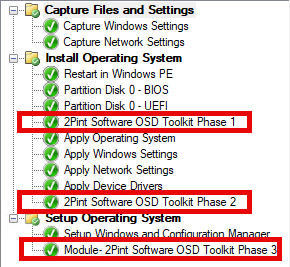

# OSDToolkit
Scripts for managing/automating anything OSDToolkit related.

## Quick Start

### Download of the Toolkit
Get the Toolkit by going here:

https://2pintsoftware.com/products/osd-toolkit

### Build your WinPE 
Build your Media using the WinPEBuilder.ps1

Requires:
- ADK Installed (I'd recommend the latest of 24H2)
- Toolkit Package
- Matching OS WIM file (ex 24H2 Enterprise x64 to match your ADK)
- Optional: Add Drivers (optional because you can do this in CM instead if you like)
- Import into ConfigMgr, and make updates as needed
  - Add Drivers
  - Add Background
  - Enable F8
  - etc
- Assign to Test OSD Task Sequence

### Import Task Sequence Modules
Import the latest available version of the export: TS Modules-2Pint Software OSD Toolkit %DATE%.zip

Add the Module Phases 1-3 into the corrisponding sections of the task sequence.  The imported modules will have a lot of notes with it already

Trigger the Task Sequence and watch that lovely P2P action.

### DP Setup
Make sure you enabled Branch Cache on your DPs!
